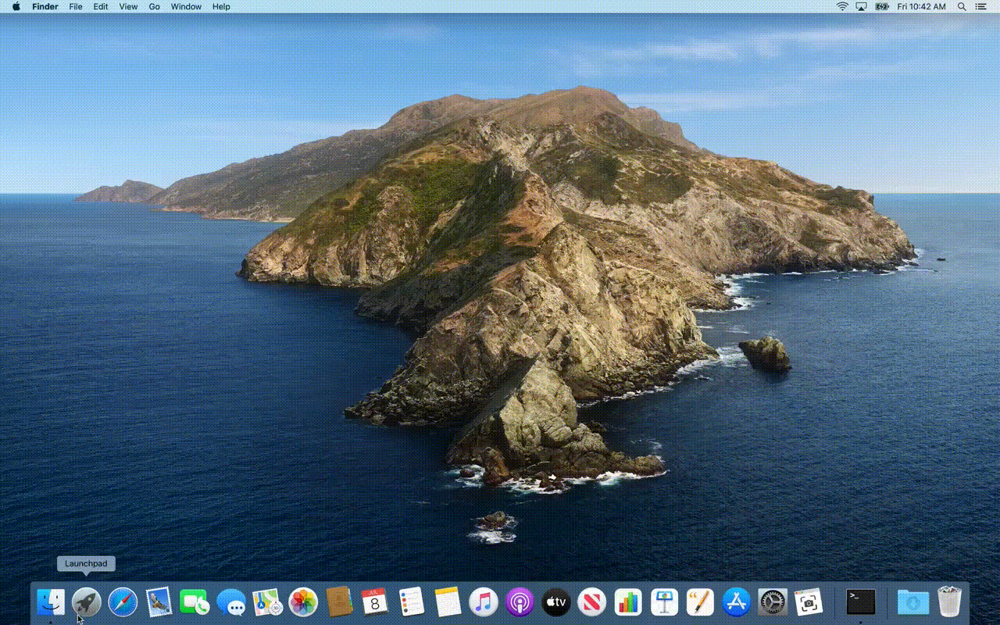
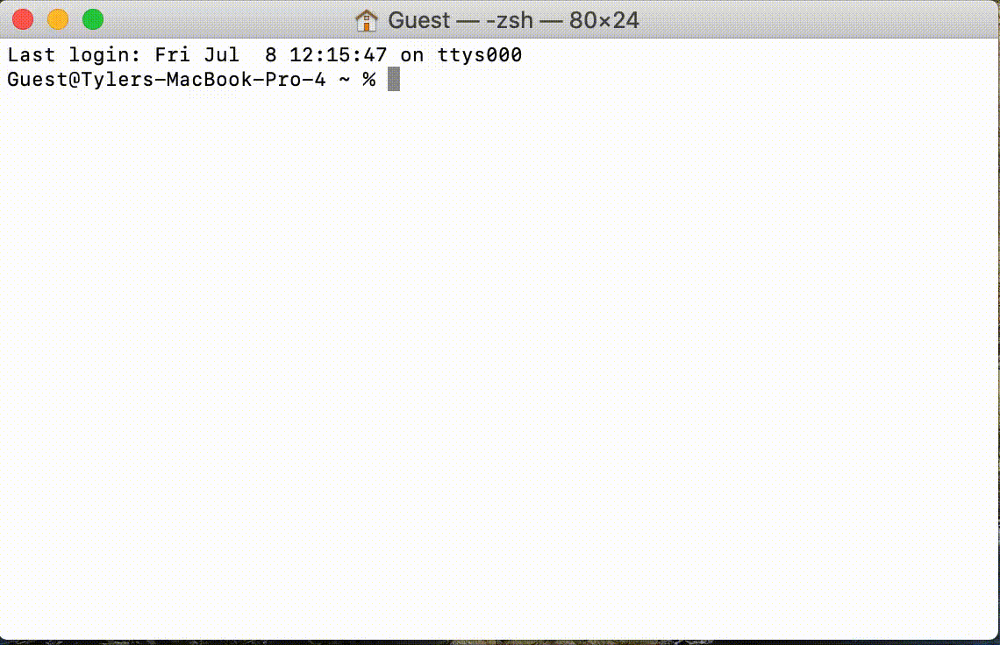
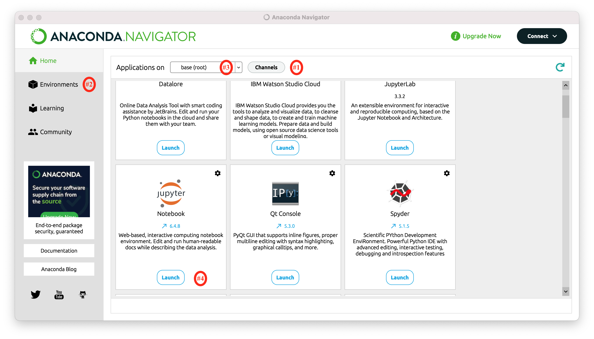

# Introduction to "An introduction into the tools and tutorials available for the analysis of TESS data" a.k.a. Step-0

## Motivation

Getting started with TESS data and tools is easy! However, it does require a couple of steps which can be daunting if you haven't done them before.  Many astronomers who have a laptop set-up for doing active research will likely have the nescessities available, however others including (but not limited to!) new students, interns, and the interested amateur astronomer, may find this brief guide usefull.  

## Learning Goals

In this tutorial we will take you from a brand new laptop or computing environment to an environment that will allow you to run the [introduction to TESS tools and tutorials notebook](https://heasarc.gsfc.nasa.gov/docs/tess/TESS-Intro.html "An introduction into the tools and tutorials available for the analysis of TESS data"), and begin exploring and working with TESS data. 

## What This Means in Practice

Practically speaking, the [subsequent TESS/lightkurve tutorials](https://heasarc.gsfc.nasa.gov/docs/tess/data-analysis-tools.html) are designed around the concept of using python and assosciated packages to interact with the TESS data in an interactive Jupyter Notebook environment. This means that the tutorials will make the following assumptions:

1. That you are operating in a [Jupyter Notebook](https://jupyter.org/) Environment

2. Running a package-controlled 3.6+ version of python, preferably with an environment manager such as [Conda](https://docs.conda.io/en/latest/) (that is installed by default with [Anaconda](https://www.anaconda.com/products/distribution))

3. With a number of packages installed, listed at the top of each tutorial, including (but not limited to) lightkurve

## Why do we assume this?

[Lightkurve](https://docs.lightkurve.org/) is a python package that will be the basis of the subsequent tutorials as it has been designed to work with time-series data from the Kepler and TESS sattelites, and is great for data interaction, exploration, and analysis as it incorporates many tools that the community might want for working with TESS data.  

To work with Lightkurve in these tutorials, we want an environment that will allow us to rapidly and interactively explore and analyze TESS data, with a visible workflow, and to share this workflow with others.  To do this, we plan to write our python analyses/code inside of [Jupyter Notebooks](https://jupyter.org/), which describe themselves as a 'web-based interactive computing platform that combines live code, equations, narrative text, visualizations, and more'.  They are a great way to explore data and to share code, analyses, and results like we do in the susbsequent tutorials, and run in your browser once set up. Their usage has also become incredibly common across both many scientific fields as well as industry usage in some fields such as data science and business analytics. 

Working with TESS and lightcurve does not *require* the use of Jupyter Notebooks, despite our tutorials presenting them in that style.  All of tutorial python commands can be run from the python command line or in a python script, although the tutorials may require minimal modifications to the plotting commands to make the graphics appear.  

Lightkurve requires a relatively recent version of python 3.X (although, on rare occasions, not the most recent version) as well as scipy and other python packages to be installed.  

A <u>package manager</u>, such as [pip](https://pypi.org/project/pip/) (the default one installed with python), will keep track of python package requirements and when you install a new package, install both missing package dependencies and upgrade/downgrade package versions to (hopefully) meet the requirements of all of your installed packages. You will however, only ever have one version of python and one list of installed packages.

An <u>environment manager</u>, such as [Conda](https://docs.conda.io/en/latest/) (and which is installed as a part of Anaconda), will allow you to have multiple, distinct, parralel, environments that you can switch between with a single command.  Each environment can (and will) have unique, and different versions of python and python packages.  Environments are a usefull (and almost mandatory) tool when you have multiple python workflows that have different, and conflicting, package and/or python requirements. Conda in particular can serve as both a package manager and an environment manager. 

## How do we get there?

For the remainder of this tutorial, we will assume that you will use [Anaconda](https://www.anaconda.com/products/distribution) to install python, jupyter notebooks, lightkurve, and dependant packages.  We choose Anaconda as it is free to individual users, its package managing tool conda is open-source, the packages in its base repository undergo a rigerous security check, is available for OsX, Windows, and Linux, and it is widely used by both the astronomy and wider community. It also includes Jupyter notebooks, matplotlib, and many commonly used packages in its default distribution. Other great options are available such as [virtualenviroment](https://pypi.org/project/virtualenv/), [pipenv](https://pypi.org/project/pipenv/), and more, and may be used to achieve similar results (although the exact steps achieve them will be left to the reader).  

## 

## What if I can't do this?

This workflow requires only a modest amount of computing power and should be functional on most any home computer or laptop with a high-speed internet connection, and if you have access to these two items and intend to work with TESS data we strongly encourage you to follow the below workflow.  If you are unable to do this however (such as having access to only a mobile device, or strict internet data caps) one potential solution is to use [Google Colab](https://colab.research.google.com/?utm_source=scs-index).  Google Colab is a cloud-based  'Jupyer notebook' like environment, where all of your data downloads and computer processing live in the cloud on a remote machine.  The upside to this is that all you need is a web-browser and a stable internet connection to participate in TESS science.  The downside is that some aspects of the notebook usage may be slower or more cumbersome, and the [TESS Data-Processing Tutorial notebooks](https://heasarc.gsfc.nasa.gov/docs/tess/data-analysis-tools.html) will require some modifications to work.  We have Translated the first tutorial into a Colab notebook [here](https://colab.research.google.com/drive/1kNUcBBc2x_06PupFIdV7RAiGEmOoi0LL?usp=sharing), and leave any modifications nescessary for future notebooks as an excercise for the reader. 

### A note on best practices & "Stretch Goals" discussed below:

This guide is primarily designed to get you looking at TESS Data as soon as possible in the most simplified manner.  This means that there are a few python 'best practices' that we're skipping over in pursuit of speed and simplicity.  We'll note what those are, label them as <u>stretch goals</u> down below, and while they are truly optional we suggest that you consider following them if you are comfortable with the nescessary steps and plan on doing further python coding beyond these tutorials.  These steps can always be performed later as well.   

### Step 1 - Download Anaconda

Install [Anaconda](https://www.anaconda.com/products/distribution) on your operating system of choice - the anaconda webpage will do a good job of guessing which installer that you need, but will also have a full list of installers available at the bottom of the page or found via the 'Get Additional Installers' link.  This is mostly usefull if you are download the installer on a different computer than you plan to install anadconda on.  

### Step 2 - Install Anaconda

Once downloaded, use the file to install Anaconda, following the [instillation instructions](https://docs.anaconda.com/anaconda/install/) from the Anaconda Documentation.  Choose your operating system (e.g. Apple OsX, Windows, etc) from the left side bar to see the appropriate instructions.

### Step 3 - Start and Enter a Jupyter Notebook

With anaconda installed, we next want to start a jupyter notebook with a python 3 kernal.  

The most common way to do this is to open up our computers command line terminal and navigate to the directory from which you would like to work on TESS data using the command line. 

#### For Apple OSX - Open up your terminal application under Applications/Utilities/Terminal

You should see something like this: 

Then, navigate to your target directory (it will open up in your 'home' directory, /Users/{username}), which is fine.  You can also make a new directory,  say TESS, and move into that directory using the command line,  e.g.

`cd ~\` This will move to your home directory if you are not already there

`mkdir TESS`This will make a new directory with the name "TESS"

`cd TESS`` This will move your terminal session into the TESS directory

#### For Windows - navigate to the folder you want to run the tutorials at and open up your command shell

You can do this by pressing ALT+D, typing in cmd, then hitting Enter.

##### <u>Stretch goal #1: Add conda-forge to your repository list:</u>

When Conda, our environment, goes to install a new software page it gets a list of available packages (and their requirements) from a repository, which is effectivly a software package warehouse. The default repository installed with Anaconda is one that is curated by the company and is designed for stable, robust packages that pass certain standards for enterprise needs. These are excellent, but miss many scientific research packages (such as Lightkurve) that are open source and community developed, but more niche or not targeted at commercial users. 

[**Conda-Forge**](https://conda-forge.org/) is a community led open-source repository that uses github and "continuous integration" software practices to allow most open source python packages to distribute themselves via the Conda environment manager.  These practices, and the lack of hand-curation, also means that many conda-forge packages are more up-to date (but possibly not more stable) than those on the Anaconda repository. **Lightkurve** is available on both conda-forge and [pip](https://pypi.org/project/pip/) (the [PyPi ](https://pypi.org/)python package manager), but not the default Anaconda repository.  

The default tutorial below suggests to install lightkurve via pip - however this can introduce inconsistencies in an environment in the future if you were to install more packages since you're now using multiple package managers. **The best practice is to only use one package/environment manage unless unavoidable.** To this end we will add the conda-forge repository channel and install lightkurve via conda to ensure consistency.  

Conda considers each repository its own 'channel', and so to add the conda-forge repository via the command line terminal:

`conda config --add channels conda-forge`

You can now install python packages that are in the conda-forge repository, however there is not a strict preferance in where to source a package between the two repositories.  To change this, and reduce the chance of future errors, you can activate `strict` channel priority via the command line terminal:

`conda config --set channel_priority strict`

##### <u>Stretch Goal #2: Create and enter a new Conda environment:</u>

Different python packages have different requirements, and when running multiple projects or pipelines it is entirely possible to need to use two packages that require different versions of the same package (including even the version of python itself!).  Environment managers help resolve this by allwoing you to create multiple silos of installed packages that you can easily switch through depending on your needs.  **The best practice here is to create a new environment for every paritcular project or task to ensure that when you install or modify python packages you don't break anything in any python workflow, and to avoid modifying the base environment.** 

Below we install lightcurve, and following the default tutorial this will be installed in your default environment, which accoding to best practices should be left minimally changed.  Here we will create a new environment for the TESS turorials and activate it so that when we install Lightkurve it will get installed in our new environment.  A new environment will not see any of the packages in the base environment, so we will also have to pass a list of packages.  We will not include the Lightkurve package in this list, although you could if you performed <u>Stretch Goal #1</u>.  

The packages we will install *explicitly* are:

- python - to get a recent version of python 3.x

- notebook - for jupyter notebooks

There will also be a (significant) number of dependant packages that that these packages require to be functional, which conda will install.  

We can create an environment named `TESS` including the specific packages above using the command-line terminal:

`conda create --name TESS python notebook`

and entering `y` to proceed when prompted

This has created a new environment, however, at the command-line we are still in our default environment.  To activate our new environment we enter:

`conda activate TESS`

**This will need to be entered each time you start a new terminal session** to enter the TESS environment, or added to your startup profile (e.g. .bashrc, .profile, etc) to automate this.  

### Then, following the [jupyter notebooks documentation](https://docs.jupyter.org/en/latest/running.html), you will start up the jupyter notebook server by entering the following at the command line (on both windows and OsX):

`jupyter notebook`

This should cause your terminal window to start printing debug information, and you should see your web browser pop open and a new page open with the notebook dashboard.    

#### If this worked, and you navigated to an empty folder called "TESS", you should see something like this:

This is empty, because the folder is empty!  To create a new notebook from which to work on TESS data and follow along with the tutorials/quickstart, click on "New" on the top right side of the page and select "Python 3" under the notebook heading

This will create a new Python 3 notebook called "Untitled" that you can execute python code from:

### Now, the last thing that our introduction tutorial requires is for lightkurve to be installed

To do this, enter the following command in the text box: 

`! python -m pip install lightkurve --upgrade`

##### <u>Stretch Goal #1.5: Install Lightkurve with `conda` instead of `pip`</u>

Assuming that you performed <u>Stretch Goal #1</u> above, this can be done with:

`! conda install lightkurve -y`

(if this installs a different python you may need to restart your jupyter notebook from the terminal)

This is following best practices to use only a single environment/package manager where possible, and if you started up jupyter notebooks after creating a new `TESS` environment this will install lightkurve into your `TESS` environment.  

This command can be executed using the Run button (or shift+return/enter).  If this is successfull, a number of lines of debug should pop up in a cell below this and end in the line (you may have to scroll through the cell) "Succesfully installed ..." followed by a list of packages installed, e.g.:

## Congratulations!  Now, you should be able to run the [introduction to TESS tools and tutorials notebook](https://heasarc.gsfc.nasa.gov/docs/tess/TESS-Intro.html "An introduction into the tools and tutorials available for the analysis of TESS data"), other [TESS tutorials]([Data Analysis Tools - TESS Science Support Center](https://heasarc.gsfc.nasa.gov/docs/tess/data-analysis-tools.html)),  and start exploring TESS data!

# 

# What if something went wrong?

- If you're having trouble installing Anaconda, see [their help page](https://docs.anaconda.com/anaconda/install/)  

- if you are having trouble opening a jupyter notebook via the terminal, you can try the [Anaconda Navigator](https://docs.anaconda.com/anaconda/navigator) application that has a graphical user interface and comes installed with anaconda. 
  
  - You can Add Channels (#1; like Conda-Forge in <u>Stretch Goal #1</u>) using the channels button. 
  
  - You can create anew environment (#2, side tab, like in <u>Stretch Goal #2</u>) and Switch to it (#3; in the drop-down menu)
  
  - You can launch a Jupyter Notebook (#4; this will open in your home directory)

- If you are having trouble past that, you can uninstall Anaconda and try again from scratch.  
  
  - If you completed <u>Stretch Goal #2</u> you can also delete your `TESS` environment (using `conda remove --name TESS --all`) and try again by creating a new environment.  

- If something is broken in the Jupyter notebook environment you can restart the kernal by going to the 'kernal' menu, or `control-c` the "notebook server" in your terminal and re-start it to re-initialize everything.
