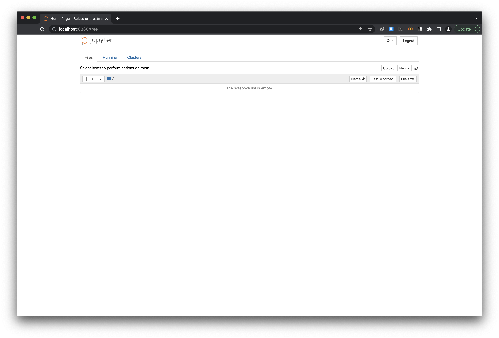
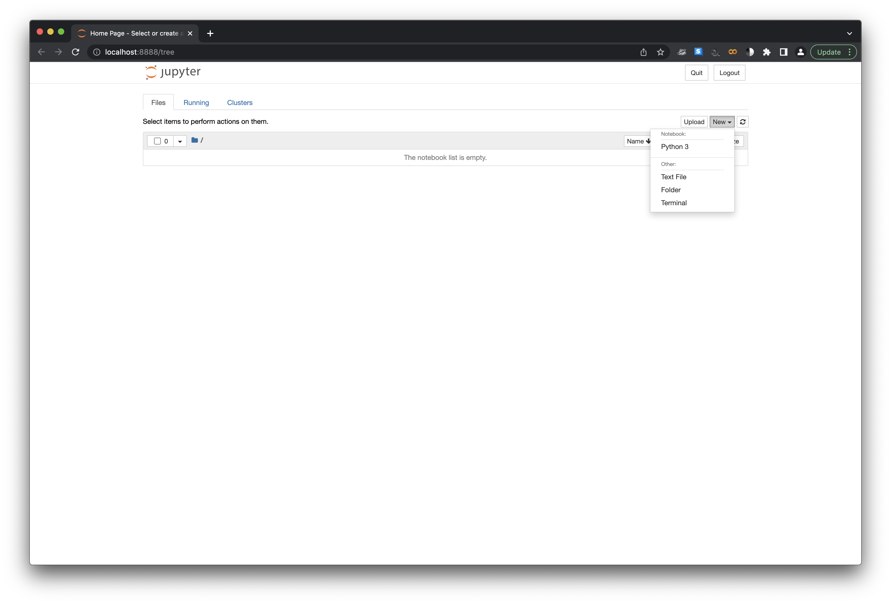
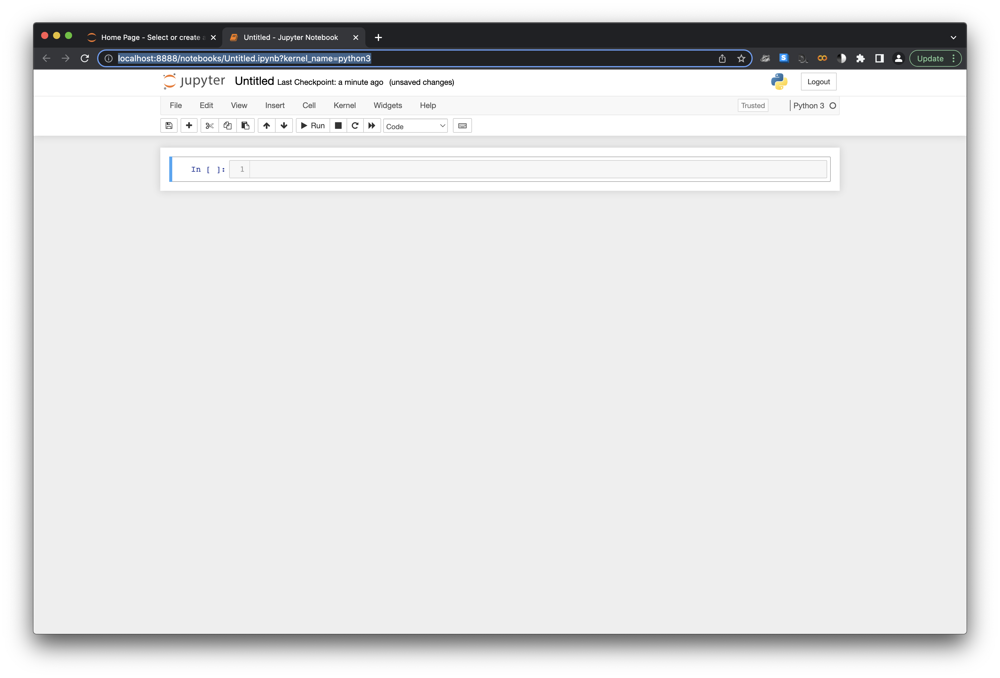
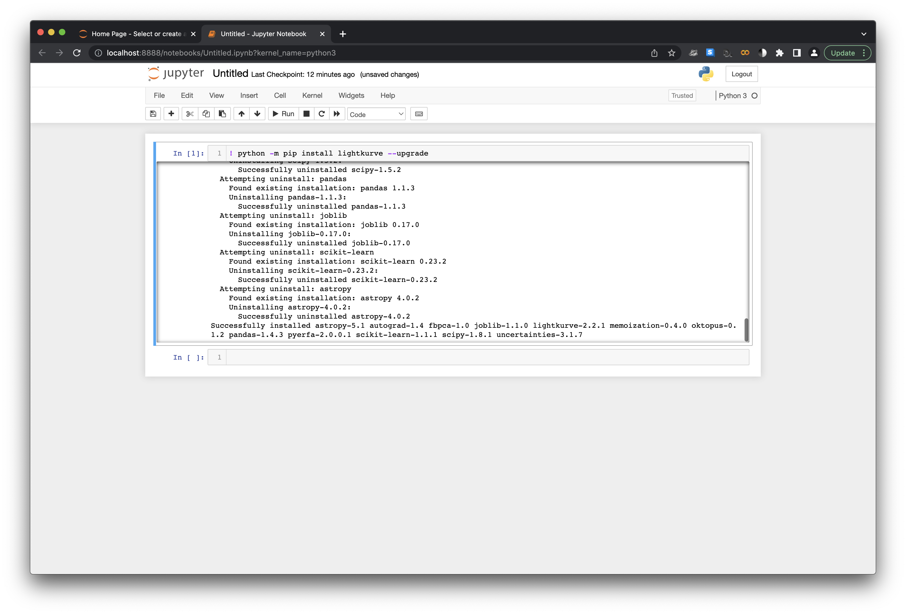

# Introduction to "An introduction into the tools and tutorials available for the analysis of TESS data" a.k.a. Step-0

*This is a first draft of a tutorial for person interested in TESS data but who is a novice computationally - its not really feature complete, tested, or edited, but its a runthrough at the level I think we were talking about to see if we're all on the same page*. 

*If this is at the level that the team was thinking, things that we might want to add include discussion of conda environments, using the conda GUI to start a notebook if thats easier, links to discussion of astro-based scientific computing/command line stuff, etc.  Let me know what y'all are thinking*.

*For easing access to those with VERY limited computing resources, we might want to 
discuss google colab since it requires internet and a browser, but no local compute or storage. If we do this, we should also probably try to do at least copy the introduction 
tutorial in colab even if we were to leave other jupyter vs colab modifications to the reader*

## Motivation

Getting started with TESS data and tools is easy! However, it does require a couple of steps which can be daunting if you haven't done them before.  Many astronomers who have a laptop set-up for doing active research will likely have the nescessities available, however others including (but not limited to!) new students, interns, and the interested amateur astronomer, may find this brief guide usefull.  

## Learning Goals

In this tutorial we will take you from a brand new laptop or computing environment to an environment that will allow you to run the [introduction to TESS tools and tutorials notebook](https://heasarc.gsfc.nasa.gov/docs/tess/TESS-Intro.html "An introduction into the tools and tutorials available for the analysis of TESS data"), and begin exploring and working with TESS data. 

## What This Means in Practice

Practically speaking, the [subsequent TESS/lightkurve tutorials](https://heasarc.gsfc.nasa.gov/docs/tess/data-analysis-tools.html) are designed around the concept of using python and assosciated packages to interact with the TESS data in an interactive Jupyter Notebook environment. This means that the tutorials will make the following assumptions:

1. That you are operating in a [Jupyter Notebook](https://jupyter.org/) Environment

2. Running a package-controlled 3.6+ version of python, preferably with an environment manager such as [Anaconda]([Anaconda | Anaconda Distribution](https://www.anaconda.com/products/distribution)).

3. With a number of packages installed, listed at the top of each tutorial, including (but not limited to) lightkurve

## Why do we assume this?

[Lightkurve](https://docs.lightkurve.org/) is a python package that will be the basis of the subsequent tutorials as it has been designed to work with time-series data from the Kepler and TESS sattelites, and is great for data interaction, exploration, and analysis as it incorporates many tools that the community might want for working with TESS data.  

To work with Lightkurve in these tutorials, we want an environment that will allow us to rapidly and interactively explore and analyze TESS data, with a visible workflow, and to share this workflow with others.  To do this, we plan to write our python analyses/code inside of [Jupyter Notebooks](https://jupyter.org/), which describe themselves as a 'web-based interactive computing platform that combines live code, equations, narrative text, visualizations, and more'.  They are a great way to explore data and to share code, analyses, and results like we do in the susbsequent tutorials, and run in your browser once set up. Their usage has also become incredibly common across both many scientific fields as well as industry usage in some fields such as data science and business analytics.  

While Jupyter notebooks may run a variety of programming languages, lightkurve and the following tutorials are python-based, and specfically require a recent version of python 3 to run (and we recommend running the most recent version). To install this, we recommend working with an environment manager such as [Anaconda]([Anaconda | Anaconda Distribution](https://www.anaconda.com/products/distribution)) which will allow you to resolve dependencies between the different required packages, and to have different 'environments' which will allow different versions of python and configurations of packages to be installed simultaneously, with an easy ability to swap between them.  

## How do we get there?

For the remainder of this tutorial, we will assume that you will use [Anaconda]([Anaconda | Anaconda Distribution](https://www.anaconda.com/products/distribution)) to install python, jupyter notebooks, lightkurve, and dependant packages.  We choose Anaconda as it is free to individual users, its package managing tool conda is open-source, the packages in its base repository undergo a rigerous security check, is available for OsX, Windows, and Linux, and it is widely used by both the astronomy and wider community. It also includes Jupyter notebooks, matplotlib, and many commonly used packages in its default distribution. Other great options are available such as [virtualenviroment]([virtualenv · PyPI](https://pypi.org/project/virtualenv/)), [pipenv]([pipenv · PyPI](https://pypi.org/project/pipenv/)), and more, and may be used to achieve similar results (although the exact steps achieve them will be left to the reader).  

### Step 1 - Download Anaconda

Install [Anaconda](Anaconda | Anaconda Distribution]([Anaconda | Anaconda Distribution](https://www.anaconda.com/products/distribution))) on your operating system of choice - the anaconda webpage will do a good job of guessing which installer that you need, but will also have a full list of installers available at the bottom of the page or found via the 'Get Additional Installers' link.  This is mostly usefull if you are downloadin the installer on a different computer than you plan to install anadconda on.  

### Step 2 - Install Anaconda

Once downloaded, use the file to install Anaconda, following the [instillation instructions]([Installation — Anaconda documentation](https://docs.anaconda.com/anaconda/install/)) from the Anaconda Documentation.  Choose your operating system (e.g. Apple OsX, Windows, etc) from the left side bar to see the appropriate instructions.

### Step 3 - Start and Enter a Jupyter Notebook

With anaconda installed, we next want to start a jupyter notebook with a python 3 kernal.  

The most common way to do this is to open up our computers command line terminal and navigate to the directory from which you would like to work on TESS data using the command line. 

#### For Apple OSX - Open up your terminal application under Applications/Utilities/Terminal

Then, navigate to your target directory (it will open up in your 'home' directory, /Users/{username}), which is fine.  You can also make a new directory,  say TESS, and move into that directory using the command line,  e.g.

`cd ~\` This will move to your home directory if you are not already there

`mkdir TESS`This will make a new directory with the name "TESS"

`cd TESS`` This will move your terminal into the TESS directory

#### For Windows - navigate to the folder you want to run the tutorials at and open up your command shell

You can do this by pressing ALT+D, typing in cmd, then hitting Enter.  

Then, following the [jupyter notebooks documentation]([Running the Notebook &#8212; Jupyter Documentation 4.1.1 alpha documentation](https://docs.jupyter.org/en/latest/running.html)), you will start up the jupyter notebook server by entering the following at the command line:

`jupyter notebook`

This should cause your terminal window to start printing debug information, and you should see your web browser pop open and a new page open with the notebook dashboard.    

#### If this worked, and you navigated to an empty folder called "TESS", you should see something like this:

This is empty, because the folder is empty!  To create a new notebook from which to work on TESS data and follow along with the tutorials/quickstart, click on "New" on the top right side of the page and select "Python 3" under the notebook heading

This will create a new Python 3 notebook called "Untitled" that you can execute python code from:

### Now, the last thing that our introduction tutorial requires is for lightkurve to be installed

To do this, enter the following command in the text box: 

`! python -m pip install lightkurve --upgrade`

and execute it using the Run button (or shift+return/enter).  If this is successfull, a number of lines of debug should pop up in a cell below this and end in the line (you may have to scroll through the cell) "Succesfully installed ..." followed by a list of packages installed, e.g.:

## Congratulations!  Now, you should be able to run the [introduction to TESS tools and tutorials notebook](https://heasarc.gsfc.nasa.gov/docs/tess/TESS-Intro.html "An introduction into the tools and tutorials available for the analysis of TESS data"), other [TESS tutorials]([Data Analysis Tools - TESS Science Support Center](https://heasarc.gsfc.nasa.gov/docs/tess/data-analysis-tools.html)),  and start exploring TESS data!

# 
